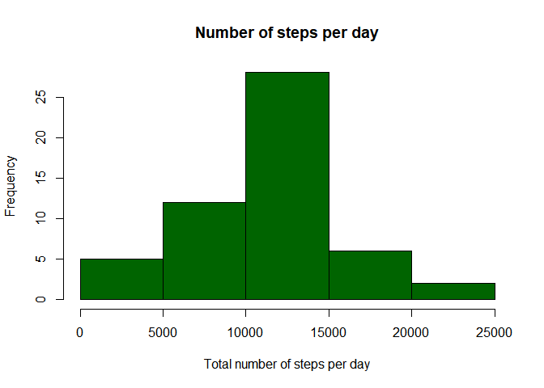
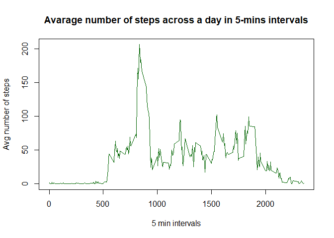

### Technical part, library load etc. 


```r
library(utils)
library(dplyr)
```

### Loading and preprocessing the data


```r
data_source <- "https://d396qusza40orc.cloudfront.net/repdata%2Fdata%2Factivity.zip"
data_dest <- paste(getwd(), "/activity.zip", sep = "")
download.file(data_source, data_dest)
unzip(data_dest)
data_read <- paste(getwd(), "/activity.csv", sep = "")

base_data <- read.csv(data_read, header = TRUE, sep = ",")
```
Lets check if data were loaded properly:


```r
head(base_data)
```

```
##   steps       date interval
## 1    NA 2012-10-01        0
## 2    NA 2012-10-01        5
## 3    NA 2012-10-01       10
## 4    NA 2012-10-01       15
## 5    NA 2012-10-01       20
## 6    NA 2012-10-01       25
```
And now remove "NA" rows:


```r
base_data_nona <- na.omit(base_data)
```
so finally data looks like:


```r
head(base_data_nona)
```

```
##     steps       date interval
## 289     0 2012-10-02        0
## 290     0 2012-10-02        5
## 291     0 2012-10-02       10
## 292     0 2012-10-02       15
## 293     0 2012-10-02       20
## 294     0 2012-10-02       25
```

### What is mean total number of steps taken per day?


```r
total_per_day <- base_data_nona %>% group_by(date) %>% summarise(sum = sum(steps))
total_per_day
```

```
## # A tibble: 53 x 2
##    date         sum
##    <chr>      <int>
##  1 2012-10-02   126
##  2 2012-10-03 11352
##  3 2012-10-04 12116
##  4 2012-10-05 13294
##  5 2012-10-06 15420
##  6 2012-10-07 11015
##  7 2012-10-09 12811
##  8 2012-10-10  9900
##  9 2012-10-11 10304
## 10 2012-10-12 17382
## # ... with 43 more rows
```

Now lets look and examine histogram of our total data:


```r
hist(total_per_day$sum, 
     main="Number of steps per day", 
     xlab = "Total number of steps per day", 
     ylab = "Frequency", 
     col="darkgreen", 
     freq = TRUE)
```

<!-- -->

and following that mean and median of total number of steps taken each day:


```r
mean(total_per_day$sum)
```

```
## [1] 10766.19
```

```r
median(total_per_day$sum)
```

```
## [1] 10765
```

### What is the average daily activity pattern?


```r
daily_pattern <- base_data_nona %>% group_by(interval) %>% summarise(mean = mean(steps))
```


```r
daily_pattern
```

```
## # A tibble: 288 x 2
##    interval   mean
##       <int>  <dbl>
##  1        0 1.72  
##  2        5 0.340 
##  3       10 0.132 
##  4       15 0.151 
##  5       20 0.0755
##  6       25 2.09  
##  7       30 0.528 
##  8       35 0.868 
##  9       40 0     
## 10       45 1.47  
## # ... with 278 more rows
```

Now, lets see how does it look on plot:


```r
plot(daily_pattern$interval, daily_pattern$mean, type = "l", main = "Avarage number of steps across a day in 5-mins intervals", xlab = "Minutes", ylab = "Avg number of steps", col="darkgreen")
```

<!-- -->

The 5-mins interval, during which on average ther biggest number of steps is taken is as following:


```r
daily_pattern[daily_pattern$mean == max(daily_pattern$mean),]
```

```
## # A tibble: 1 x 2
##   interval  mean
##      <int> <dbl>
## 1      835  206.
```

### Imputing missing values
Lets start witch checking how many missing values do we have in our data set:


```r
summary(base_data)
```

```
##      steps            date              interval     
##  Min.   :  0.00   Length:17568       Min.   :   0.0  
##  1st Qu.:  0.00   Class :character   1st Qu.: 588.8  
##  Median :  0.00   Mode  :character   Median :1177.5  
##  Mean   : 37.38                      Mean   :1177.5  
##  3rd Qu.: 12.00                      3rd Qu.:1766.2  
##  Max.   :806.00                      Max.   :2355.0  
##  NA's   :2304
```


### Are there differences in activity patterns between weekdays and weekends?
