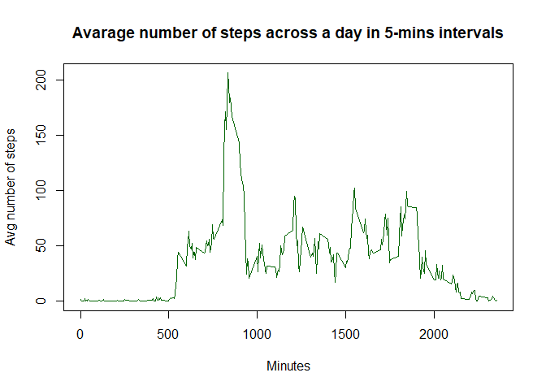

### Technical part, library load etc. 


```r
library(utils)
library(dplyr)
library(ggplot2)  
```

### Loading and preprocessing the data


```r
data_source <- "https://d396qusza40orc.cloudfront.net/repdata%2Fdata%2Factivity.zip"
data_dest <- paste(getwd(), "/activity.zip", sep = "")
download.file(data_source, data_dest)
unzip(data_dest)
data_read <- paste(getwd(), "/activity.csv", sep = "")

base_data <- read.csv(data_read, header = TRUE, sep = ",")
```
Lets check if data were loaded properly:


```r
head(base_data, 1000)
```

```
##      steps       date interval
## 1       NA 2012-10-01        0
## 2       NA 2012-10-01        5
## 3       NA 2012-10-01       10
## 4       NA 2012-10-01       15
## 5       NA 2012-10-01       20
## 6       NA 2012-10-01       25
## 7       NA 2012-10-01       30
## 8       NA 2012-10-01       35
## 9       NA 2012-10-01       40
## 10      NA 2012-10-01       45
## 11      NA 2012-10-01       50
## 12      NA 2012-10-01       55
## 13      NA 2012-10-01      100
## 14      NA 2012-10-01      105
## 15      NA 2012-10-01      110
## 16      NA 2012-10-01      115
## 17      NA 2012-10-01      120
## 18      NA 2012-10-01      125
## 19      NA 2012-10-01      130
## 20      NA 2012-10-01      135
## 21      NA 2012-10-01      140
## 22      NA 2012-10-01      145
## 23      NA 2012-10-01      150
## 24      NA 2012-10-01      155
## 25      NA 2012-10-01      200
## 26      NA 2012-10-01      205
## 27      NA 2012-10-01      210
## 28      NA 2012-10-01      215
## 29      NA 2012-10-01      220
## 30      NA 2012-10-01      225
## 31      NA 2012-10-01      230
## 32      NA 2012-10-01      235
## 33      NA 2012-10-01      240
## 34      NA 2012-10-01      245
## 35      NA 2012-10-01      250
## 36      NA 2012-10-01      255
## 37      NA 2012-10-01      300
## 38      NA 2012-10-01      305
## 39      NA 2012-10-01      310
## 40      NA 2012-10-01      315
## 41      NA 2012-10-01      320
## 42      NA 2012-10-01      325
## 43      NA 2012-10-01      330
## 44      NA 2012-10-01      335
## 45      NA 2012-10-01      340
## 46      NA 2012-10-01      345
## 47      NA 2012-10-01      350
## 48      NA 2012-10-01      355
## 49      NA 2012-10-01      400
## 50      NA 2012-10-01      405
## 51      NA 2012-10-01      410
## 52      NA 2012-10-01      415
## 53      NA 2012-10-01      420
## 54      NA 2012-10-01      425
## 55      NA 2012-10-01      430
## 56      NA 2012-10-01      435
## 57      NA 2012-10-01      440
## 58      NA 2012-10-01      445
## 59      NA 2012-10-01      450
## 60      NA 2012-10-01      455
## 61      NA 2012-10-01      500
## 62      NA 2012-10-01      505
## 63      NA 2012-10-01      510
## 64      NA 2012-10-01      515
## 65      NA 2012-10-01      520
## 66      NA 2012-10-01      525
## 67      NA 2012-10-01      530
## 68      NA 2012-10-01      535
## 69      NA 2012-10-01      540
## 70      NA 2012-10-01      545
## 71      NA 2012-10-01      550
## 72      NA 2012-10-01      555
## 73      NA 2012-10-01      600
## 74      NA 2012-10-01      605
## 75      NA 2012-10-01      610
## 76      NA 2012-10-01      615
## 77      NA 2012-10-01      620
## 78      NA 2012-10-01      625
## 79      NA 2012-10-01      630
## 80      NA 2012-10-01      635
## 81      NA 2012-10-01      640
## 82      NA 2012-10-01      645
## 83      NA 2012-10-01      650
## 84      NA 2012-10-01      655
## 85      NA 2012-10-01      700
## 86      NA 2012-10-01      705
## 87      NA 2012-10-01      710
## 88      NA 2012-10-01      715
## 89      NA 2012-10-01      720
## 90      NA 2012-10-01      725
## 91      NA 2012-10-01      730
## 92      NA 2012-10-01      735
## 93      NA 2012-10-01      740
## 94      NA 2012-10-01      745
## 95      NA 2012-10-01      750
## 96      NA 2012-10-01      755
## 97      NA 2012-10-01      800
## 98      NA 2012-10-01      805
## 99      NA 2012-10-01      810
## 100     NA 2012-10-01      815
## 101     NA 2012-10-01      820
## 102     NA 2012-10-01      825
## 103     NA 2012-10-01      830
## 104     NA 2012-10-01      835
## 105     NA 2012-10-01      840
## 106     NA 2012-10-01      845
## 107     NA 2012-10-01      850
## 108     NA 2012-10-01      855
## 109     NA 2012-10-01      900
## 110     NA 2012-10-01      905
## 111     NA 2012-10-01      910
## 112     NA 2012-10-01      915
## 113     NA 2012-10-01      920
## 114     NA 2012-10-01      925
## 115     NA 2012-10-01      930
## 116     NA 2012-10-01      935
## 117     NA 2012-10-01      940
## 118     NA 2012-10-01      945
## 119     NA 2012-10-01      950
## 120     NA 2012-10-01      955
## 121     NA 2012-10-01     1000
## 122     NA 2012-10-01     1005
## 123     NA 2012-10-01     1010
## 124     NA 2012-10-01     1015
## 125     NA 2012-10-01     1020
## 126     NA 2012-10-01     1025
## 127     NA 2012-10-01     1030
## 128     NA 2012-10-01     1035
## 129     NA 2012-10-01     1040
## 130     NA 2012-10-01     1045
## 131     NA 2012-10-01     1050
## 132     NA 2012-10-01     1055
## 133     NA 2012-10-01     1100
## 134     NA 2012-10-01     1105
## 135     NA 2012-10-01     1110
## 136     NA 2012-10-01     1115
## 137     NA 2012-10-01     1120
## 138     NA 2012-10-01     1125
## 139     NA 2012-10-01     1130
## 140     NA 2012-10-01     1135
## 141     NA 2012-10-01     1140
## 142     NA 2012-10-01     1145
## 143     NA 2012-10-01     1150
## 144     NA 2012-10-01     1155
## 145     NA 2012-10-01     1200
## 146     NA 2012-10-01     1205
## 147     NA 2012-10-01     1210
## 148     NA 2012-10-01     1215
## 149     NA 2012-10-01     1220
## 150     NA 2012-10-01     1225
## 151     NA 2012-10-01     1230
## 152     NA 2012-10-01     1235
## 153     NA 2012-10-01     1240
## 154     NA 2012-10-01     1245
## 155     NA 2012-10-01     1250
## 156     NA 2012-10-01     1255
## 157     NA 2012-10-01     1300
## 158     NA 2012-10-01     1305
## 159     NA 2012-10-01     1310
## 160     NA 2012-10-01     1315
## 161     NA 2012-10-01     1320
## 162     NA 2012-10-01     1325
## 163     NA 2012-10-01     1330
## 164     NA 2012-10-01     1335
## 165     NA 2012-10-01     1340
## 166     NA 2012-10-01     1345
## 167     NA 2012-10-01     1350
## 168     NA 2012-10-01     1355
## 169     NA 2012-10-01     1400
## 170     NA 2012-10-01     1405
## 171     NA 2012-10-01     1410
## 172     NA 2012-10-01     1415
## 173     NA 2012-10-01     1420
## 174     NA 2012-10-01     1425
## 175     NA 2012-10-01     1430
## 176     NA 2012-10-01     1435
## 177     NA 2012-10-01     1440
## 178     NA 2012-10-01     1445
## 179     NA 2012-10-01     1450
## 180     NA 2012-10-01     1455
## 181     NA 2012-10-01     1500
## 182     NA 2012-10-01     1505
## 183     NA 2012-10-01     1510
## 184     NA 2012-10-01     1515
## 185     NA 2012-10-01     1520
## 186     NA 2012-10-01     1525
## 187     NA 2012-10-01     1530
## 188     NA 2012-10-01     1535
## 189     NA 2012-10-01     1540
## 190     NA 2012-10-01     1545
## 191     NA 2012-10-01     1550
## 192     NA 2012-10-01     1555
## 193     NA 2012-10-01     1600
## 194     NA 2012-10-01     1605
## 195     NA 2012-10-01     1610
## 196     NA 2012-10-01     1615
## 197     NA 2012-10-01     1620
## 198     NA 2012-10-01     1625
## 199     NA 2012-10-01     1630
## 200     NA 2012-10-01     1635
## 201     NA 2012-10-01     1640
## 202     NA 2012-10-01     1645
## 203     NA 2012-10-01     1650
## 204     NA 2012-10-01     1655
## 205     NA 2012-10-01     1700
## 206     NA 2012-10-01     1705
## 207     NA 2012-10-01     1710
## 208     NA 2012-10-01     1715
## 209     NA 2012-10-01     1720
## 210     NA 2012-10-01     1725
## 211     NA 2012-10-01     1730
## 212     NA 2012-10-01     1735
## 213     NA 2012-10-01     1740
## 214     NA 2012-10-01     1745
## 215     NA 2012-10-01     1750
## 216     NA 2012-10-01     1755
## 217     NA 2012-10-01     1800
## 218     NA 2012-10-01     1805
## 219     NA 2012-10-01     1810
## 220     NA 2012-10-01     1815
## 221     NA 2012-10-01     1820
## 222     NA 2012-10-01     1825
## 223     NA 2012-10-01     1830
## 224     NA 2012-10-01     1835
## 225     NA 2012-10-01     1840
## 226     NA 2012-10-01     1845
## 227     NA 2012-10-01     1850
## 228     NA 2012-10-01     1855
## 229     NA 2012-10-01     1900
## 230     NA 2012-10-01     1905
## 231     NA 2012-10-01     1910
## 232     NA 2012-10-01     1915
## 233     NA 2012-10-01     1920
## 234     NA 2012-10-01     1925
## 235     NA 2012-10-01     1930
## 236     NA 2012-10-01     1935
## 237     NA 2012-10-01     1940
## 238     NA 2012-10-01     1945
## 239     NA 2012-10-01     1950
## 240     NA 2012-10-01     1955
## 241     NA 2012-10-01     2000
## 242     NA 2012-10-01     2005
## 243     NA 2012-10-01     2010
## 244     NA 2012-10-01     2015
## 245     NA 2012-10-01     2020
## 246     NA 2012-10-01     2025
## 247     NA 2012-10-01     2030
## 248     NA 2012-10-01     2035
## 249     NA 2012-10-01     2040
## 250     NA 2012-10-01     2045
## 251     NA 2012-10-01     2050
## 252     NA 2012-10-01     2055
## 253     NA 2012-10-01     2100
## 254     NA 2012-10-01     2105
## 255     NA 2012-10-01     2110
## 256     NA 2012-10-01     2115
## 257     NA 2012-10-01     2120
## 258     NA 2012-10-01     2125
## 259     NA 2012-10-01     2130
## 260     NA 2012-10-01     2135
## 261     NA 2012-10-01     2140
## 262     NA 2012-10-01     2145
## 263     NA 2012-10-01     2150
## 264     NA 2012-10-01     2155
## 265     NA 2012-10-01     2200
## 266     NA 2012-10-01     2205
## 267     NA 2012-10-01     2210
## 268     NA 2012-10-01     2215
## 269     NA 2012-10-01     2220
## 270     NA 2012-10-01     2225
## 271     NA 2012-10-01     2230
## 272     NA 2012-10-01     2235
## 273     NA 2012-10-01     2240
## 274     NA 2012-10-01     2245
## 275     NA 2012-10-01     2250
## 276     NA 2012-10-01     2255
## 277     NA 2012-10-01     2300
## 278     NA 2012-10-01     2305
## 279     NA 2012-10-01     2310
## 280     NA 2012-10-01     2315
## 281     NA 2012-10-01     2320
## 282     NA 2012-10-01     2325
## 283     NA 2012-10-01     2330
## 284     NA 2012-10-01     2335
## 285     NA 2012-10-01     2340
## 286     NA 2012-10-01     2345
## 287     NA 2012-10-01     2350
## 288     NA 2012-10-01     2355
## 289      0 2012-10-02        0
## 290      0 2012-10-02        5
## 291      0 2012-10-02       10
## 292      0 2012-10-02       15
## 293      0 2012-10-02       20
## 294      0 2012-10-02       25
## 295      0 2012-10-02       30
## 296      0 2012-10-02       35
## 297      0 2012-10-02       40
## 298      0 2012-10-02       45
## 299      0 2012-10-02       50
## 300      0 2012-10-02       55
## 301      0 2012-10-02      100
## 302      0 2012-10-02      105
## 303      0 2012-10-02      110
## 304      0 2012-10-02      115
## 305      0 2012-10-02      120
## 306      0 2012-10-02      125
## 307      0 2012-10-02      130
## 308      0 2012-10-02      135
## 309      0 2012-10-02      140
## 310      0 2012-10-02      145
## 311      0 2012-10-02      150
## 312      0 2012-10-02      155
## 313      0 2012-10-02      200
## 314      0 2012-10-02      205
## 315      0 2012-10-02      210
## 316      0 2012-10-02      215
## 317      0 2012-10-02      220
## 318      0 2012-10-02      225
## 319      0 2012-10-02      230
## 320      0 2012-10-02      235
## 321      0 2012-10-02      240
## 322      0 2012-10-02      245
## 323      0 2012-10-02      250
## 324      0 2012-10-02      255
## 325      0 2012-10-02      300
## 326      0 2012-10-02      305
## 327      0 2012-10-02      310
## 328      0 2012-10-02      315
## 329      0 2012-10-02      320
## 330      0 2012-10-02      325
## 331      0 2012-10-02      330
## 332      0 2012-10-02      335
## 333      0 2012-10-02      340
## 334      0 2012-10-02      345
## 335      0 2012-10-02      350
## 336      0 2012-10-02      355
## 337      0 2012-10-02      400
## 338      0 2012-10-02      405
## 339      0 2012-10-02      410
## 340      0 2012-10-02      415
## 341      0 2012-10-02      420
## 342      0 2012-10-02      425
## 343      0 2012-10-02      430
## 344      0 2012-10-02      435
## 345      0 2012-10-02      440
## 346      0 2012-10-02      445
## 347      0 2012-10-02      450
## 348      0 2012-10-02      455
## 349      0 2012-10-02      500
## 350      0 2012-10-02      505
## 351      0 2012-10-02      510
## 352      0 2012-10-02      515
## 353      0 2012-10-02      520
## 354      0 2012-10-02      525
## 355      0 2012-10-02      530
## 356      0 2012-10-02      535
## 357      0 2012-10-02      540
## 358      0 2012-10-02      545
## 359      0 2012-10-02      550
## 360      0 2012-10-02      555
## 361      0 2012-10-02      600
## 362      0 2012-10-02      605
## 363      0 2012-10-02      610
## 364      0 2012-10-02      615
## 365      0 2012-10-02      620
## 366      0 2012-10-02      625
## 367      0 2012-10-02      630
## 368      0 2012-10-02      635
## 369      0 2012-10-02      640
## 370      0 2012-10-02      645
## 371      0 2012-10-02      650
## 372      0 2012-10-02      655
## 373      0 2012-10-02      700
## 374      0 2012-10-02      705
## 375      0 2012-10-02      710
## 376      0 2012-10-02      715
## 377      0 2012-10-02      720
## 378      0 2012-10-02      725
## 379      0 2012-10-02      730
## 380      0 2012-10-02      735
## 381      0 2012-10-02      740
## 382      0 2012-10-02      745
## 383      0 2012-10-02      750
## 384      0 2012-10-02      755
## 385      0 2012-10-02      800
## 386      0 2012-10-02      805
## 387      0 2012-10-02      810
## 388      0 2012-10-02      815
## 389      0 2012-10-02      820
## 390      0 2012-10-02      825
## 391      0 2012-10-02      830
## 392      0 2012-10-02      835
## 393      0 2012-10-02      840
## 394      0 2012-10-02      845
## 395      0 2012-10-02      850
## 396      0 2012-10-02      855
## 397      0 2012-10-02      900
## 398      0 2012-10-02      905
## 399      0 2012-10-02      910
## 400      0 2012-10-02      915
## 401      0 2012-10-02      920
## 402      0 2012-10-02      925
## 403      0 2012-10-02      930
## 404      0 2012-10-02      935
## 405      0 2012-10-02      940
## 406      0 2012-10-02      945
## 407      0 2012-10-02      950
## 408      0 2012-10-02      955
## 409      0 2012-10-02     1000
## 410      0 2012-10-02     1005
## 411      0 2012-10-02     1010
## 412      0 2012-10-02     1015
## 413      0 2012-10-02     1020
## 414      0 2012-10-02     1025
## 415      0 2012-10-02     1030
## 416      0 2012-10-02     1035
## 417      0 2012-10-02     1040
## 418      0 2012-10-02     1045
## 419      0 2012-10-02     1050
## 420      0 2012-10-02     1055
## 421      0 2012-10-02     1100
## 422      0 2012-10-02     1105
## 423      0 2012-10-02     1110
## 424      0 2012-10-02     1115
## 425      0 2012-10-02     1120
## 426      0 2012-10-02     1125
## 427      0 2012-10-02     1130
## 428      0 2012-10-02     1135
## 429      0 2012-10-02     1140
## 430      0 2012-10-02     1145
## 431      0 2012-10-02     1150
## 432      0 2012-10-02     1155
## 433      0 2012-10-02     1200
## 434      0 2012-10-02     1205
## 435      0 2012-10-02     1210
## 436      0 2012-10-02     1215
## 437      0 2012-10-02     1220
## 438      0 2012-10-02     1225
## 439      0 2012-10-02     1230
## 440      0 2012-10-02     1235
## 441      0 2012-10-02     1240
## 442      0 2012-10-02     1245
## 443      0 2012-10-02     1250
## 444      0 2012-10-02     1255
## 445      0 2012-10-02     1300
## 446      0 2012-10-02     1305
## 447      0 2012-10-02     1310
## 448      0 2012-10-02     1315
## 449      0 2012-10-02     1320
## 450      0 2012-10-02     1325
## 451      0 2012-10-02     1330
## 452      0 2012-10-02     1335
## 453      0 2012-10-02     1340
## 454      0 2012-10-02     1345
## 455      0 2012-10-02     1350
## 456      0 2012-10-02     1355
## 457      0 2012-10-02     1400
## 458      0 2012-10-02     1405
## 459      0 2012-10-02     1410
## 460      0 2012-10-02     1415
## 461      0 2012-10-02     1420
## 462      0 2012-10-02     1425
## 463      0 2012-10-02     1430
## 464      0 2012-10-02     1435
## 465      0 2012-10-02     1440
## 466      0 2012-10-02     1445
## 467      0 2012-10-02     1450
## 468      0 2012-10-02     1455
## 469      0 2012-10-02     1500
## 470      0 2012-10-02     1505
## 471      0 2012-10-02     1510
## 472      0 2012-10-02     1515
## 473      0 2012-10-02     1520
## 474      0 2012-10-02     1525
## 475      0 2012-10-02     1530
## 476      0 2012-10-02     1535
## 477      0 2012-10-02     1540
## 478      0 2012-10-02     1545
## 479      0 2012-10-02     1550
## 480      0 2012-10-02     1555
## 481      0 2012-10-02     1600
## 482      0 2012-10-02     1605
## 483      0 2012-10-02     1610
## 484      0 2012-10-02     1615
## 485      0 2012-10-02     1620
## 486      0 2012-10-02     1625
## 487      0 2012-10-02     1630
## 488      0 2012-10-02     1635
## 489      0 2012-10-02     1640
## 490      0 2012-10-02     1645
## 491      0 2012-10-02     1650
## 492      0 2012-10-02     1655
## 493      0 2012-10-02     1700
## 494      0 2012-10-02     1705
## 495      0 2012-10-02     1710
## 496      0 2012-10-02     1715
## 497      0 2012-10-02     1720
## 498      0 2012-10-02     1725
## 499      0 2012-10-02     1730
## 500      0 2012-10-02     1735
## 501      0 2012-10-02     1740
## 502      0 2012-10-02     1745
## 503      0 2012-10-02     1750
## 504      0 2012-10-02     1755
## 505      0 2012-10-02     1800
## 506      0 2012-10-02     1805
## 507      0 2012-10-02     1810
## 508      0 2012-10-02     1815
## 509      0 2012-10-02     1820
## 510      0 2012-10-02     1825
## 511      0 2012-10-02     1830
## 512      0 2012-10-02     1835
## 513      0 2012-10-02     1840
## 514      0 2012-10-02     1845
## 515      0 2012-10-02     1850
## 516      0 2012-10-02     1855
## 517      0 2012-10-02     1900
## 518      0 2012-10-02     1905
## 519      0 2012-10-02     1910
## 520      0 2012-10-02     1915
## 521      0 2012-10-02     1920
## 522      0 2012-10-02     1925
## 523      0 2012-10-02     1930
## 524      0 2012-10-02     1935
## 525      0 2012-10-02     1940
## 526      0 2012-10-02     1945
## 527      0 2012-10-02     1950
## 528      0 2012-10-02     1955
## 529      0 2012-10-02     2000
## 530      0 2012-10-02     2005
## 531      0 2012-10-02     2010
## 532      0 2012-10-02     2015
## 533      0 2012-10-02     2020
## 534      0 2012-10-02     2025
## 535      0 2012-10-02     2030
## 536      0 2012-10-02     2035
## 537      0 2012-10-02     2040
## 538      0 2012-10-02     2045
## 539      0 2012-10-02     2050
## 540      0 2012-10-02     2055
## 541      0 2012-10-02     2100
## 542      0 2012-10-02     2105
## 543      0 2012-10-02     2110
## 544      0 2012-10-02     2115
## 545      0 2012-10-02     2120
## 546      0 2012-10-02     2125
## 547      0 2012-10-02     2130
## 548      0 2012-10-02     2135
## 549      0 2012-10-02     2140
## 550      0 2012-10-02     2145
## 551      0 2012-10-02     2150
## 552      0 2012-10-02     2155
## 553      0 2012-10-02     2200
## 554      0 2012-10-02     2205
## 555    117 2012-10-02     2210
## 556      9 2012-10-02     2215
## 557      0 2012-10-02     2220
## 558      0 2012-10-02     2225
## 559      0 2012-10-02     2230
## 560      0 2012-10-02     2235
## 561      0 2012-10-02     2240
## 562      0 2012-10-02     2245
## 563      0 2012-10-02     2250
## 564      0 2012-10-02     2255
## 565      0 2012-10-02     2300
## 566      0 2012-10-02     2305
## 567      0 2012-10-02     2310
## 568      0 2012-10-02     2315
## 569      0 2012-10-02     2320
## 570      0 2012-10-02     2325
## 571      0 2012-10-02     2330
## 572      0 2012-10-02     2335
## 573      0 2012-10-02     2340
## 574      0 2012-10-02     2345
## 575      0 2012-10-02     2350
## 576      0 2012-10-02     2355
## 577      0 2012-10-03        0
## 578      0 2012-10-03        5
## 579      0 2012-10-03       10
## 580      0 2012-10-03       15
## 581      0 2012-10-03       20
## 582      0 2012-10-03       25
## 583      0 2012-10-03       30
## 584      0 2012-10-03       35
## 585      0 2012-10-03       40
## 586      0 2012-10-03       45
## 587      0 2012-10-03       50
## 588      0 2012-10-03       55
## 589      0 2012-10-03      100
## 590      0 2012-10-03      105
## 591      0 2012-10-03      110
## 592      0 2012-10-03      115
## 593      0 2012-10-03      120
## 594      0 2012-10-03      125
## 595      0 2012-10-03      130
## 596      0 2012-10-03      135
## 597      0 2012-10-03      140
## 598      0 2012-10-03      145
## 599      0 2012-10-03      150
## 600      0 2012-10-03      155
## 601      0 2012-10-03      200
## 602      0 2012-10-03      205
## 603      0 2012-10-03      210
## 604      0 2012-10-03      215
## 605      0 2012-10-03      220
## 606      0 2012-10-03      225
## 607      0 2012-10-03      230
## 608      0 2012-10-03      235
## 609      0 2012-10-03      240
## 610      0 2012-10-03      245
## 611      0 2012-10-03      250
## 612      0 2012-10-03      255
## 613      0 2012-10-03      300
## 614      0 2012-10-03      305
## 615      0 2012-10-03      310
## 616      0 2012-10-03      315
## 617      0 2012-10-03      320
## 618      0 2012-10-03      325
## 619      0 2012-10-03      330
## 620      0 2012-10-03      335
## 621      0 2012-10-03      340
## 622      0 2012-10-03      345
## 623      0 2012-10-03      350
## 624      0 2012-10-03      355
## 625      0 2012-10-03      400
## 626      0 2012-10-03      405
## 627      4 2012-10-03      410
## 628      0 2012-10-03      415
## 629      0 2012-10-03      420
## 630      0 2012-10-03      425
## 631     36 2012-10-03      430
## 632      0 2012-10-03      435
## 633      0 2012-10-03      440
## 634      0 2012-10-03      445
## 635      0 2012-10-03      450
## 636      0 2012-10-03      455
## 637      0 2012-10-03      500
## 638      0 2012-10-03      505
## 639      0 2012-10-03      510
## 640      0 2012-10-03      515
## 641      0 2012-10-03      520
## 642      0 2012-10-03      525
## 643      0 2012-10-03      530
## 644     25 2012-10-03      535
## 645      0 2012-10-03      540
## 646      0 2012-10-03      545
## 647     90 2012-10-03      550
## 648    411 2012-10-03      555
## 649    413 2012-10-03      600
## 650    415 2012-10-03      605
## 651    519 2012-10-03      610
## 652    529 2012-10-03      615
## 653    613 2012-10-03      620
## 654    562 2012-10-03      625
## 655    612 2012-10-03      630
## 656    534 2012-10-03      635
## 657    323 2012-10-03      640
## 658    600 2012-10-03      645
## 659    533 2012-10-03      650
## 660    251 2012-10-03      655
## 661     56 2012-10-03      700
## 662      0 2012-10-03      705
## 663     32 2012-10-03      710
## 664     80 2012-10-03      715
## 665     10 2012-10-03      720
## 666      9 2012-10-03      725
## 667    145 2012-10-03      730
## 668     46 2012-10-03      735
## 669      0 2012-10-03      740
## 670     44 2012-10-03      745
## 671    126 2012-10-03      750
## 672     42 2012-10-03      755
## 673    138 2012-10-03      800
## 674     53 2012-10-03      805
## 675      0 2012-10-03      810
## 676      0 2012-10-03      815
## 677     22 2012-10-03      820
## 678     57 2012-10-03      825
## 679    161 2012-10-03      830
## 680     19 2012-10-03      835
## 681     15 2012-10-03      840
## 682      0 2012-10-03      845
## 683     16 2012-10-03      850
## 684      0 2012-10-03      855
## 685      0 2012-10-03      900
## 686      8 2012-10-03      905
## 687      0 2012-10-03      910
## 688     51 2012-10-03      915
## 689    516 2012-10-03      920
## 690    245 2012-10-03      925
## 691      0 2012-10-03      930
## 692    161 2012-10-03      935
## 693      7 2012-10-03      940
## 694      0 2012-10-03      945
## 695      0 2012-10-03      950
## 696      0 2012-10-03      955
## 697      0 2012-10-03     1000
## 698      0 2012-10-03     1005
## 699      0 2012-10-03     1010
## 700      0 2012-10-03     1015
## 701      0 2012-10-03     1020
## 702      0 2012-10-03     1025
## 703      0 2012-10-03     1030
## 704      0 2012-10-03     1035
## 705      0 2012-10-03     1040
## 706      0 2012-10-03     1045
## 707      0 2012-10-03     1050
## 708      0 2012-10-03     1055
## 709      0 2012-10-03     1100
## 710      0 2012-10-03     1105
## 711      0 2012-10-03     1110
## 712      0 2012-10-03     1115
## 713      0 2012-10-03     1120
## 714      0 2012-10-03     1125
## 715      0 2012-10-03     1130
## 716     72 2012-10-03     1135
## 717     73 2012-10-03     1140
## 718      0 2012-10-03     1145
## 719      0 2012-10-03     1150
## 720    116 2012-10-03     1155
## 721     97 2012-10-03     1200
## 722      0 2012-10-03     1205
## 723      0 2012-10-03     1210
## 724      0 2012-10-03     1215
## 725      0 2012-10-03     1220
## 726      0 2012-10-03     1225
## 727     15 2012-10-03     1230
## 728      0 2012-10-03     1235
## 729      0 2012-10-03     1240
## 730      0 2012-10-03     1245
## 731      0 2012-10-03     1250
## 732      0 2012-10-03     1255
## 733     80 2012-10-03     1300
## 734     69 2012-10-03     1305
## 735      0 2012-10-03     1310
## 736      0 2012-10-03     1315
## 737      0 2012-10-03     1320
## 738      0 2012-10-03     1325
## 739      0 2012-10-03     1330
## 740      0 2012-10-03     1335
## 741      0 2012-10-03     1340
## 742     99 2012-10-03     1345
## 743    100 2012-10-03     1350
## 744      0 2012-10-03     1355
## 745      0 2012-10-03     1400
## 746     33 2012-10-03     1405
## 747      0 2012-10-03     1410
## 748      0 2012-10-03     1415
## 749      7 2012-10-03     1420
## 750      0 2012-10-03     1425
## 751      0 2012-10-03     1430
## 752      0 2012-10-03     1435
## 753      0 2012-10-03     1440
## 754      0 2012-10-03     1445
## 755      0 2012-10-03     1450
## 756      0 2012-10-03     1455
## 757      0 2012-10-03     1500
## 758      0 2012-10-03     1505
## 759      0 2012-10-03     1510
## 760      0 2012-10-03     1515
## 761      0 2012-10-03     1520
## 762      0 2012-10-03     1525
## 763      0 2012-10-03     1530
## 764      0 2012-10-03     1535
## 765      0 2012-10-03     1540
## 766     88 2012-10-03     1545
## 767    154 2012-10-03     1550
## 768      0 2012-10-03     1555
## 769     20 2012-10-03     1600
## 770      0 2012-10-03     1605
## 771      0 2012-10-03     1610
## 772      0 2012-10-03     1615
## 773      0 2012-10-03     1620
## 774      0 2012-10-03     1625
## 775      0 2012-10-03     1630
## 776      0 2012-10-03     1635
## 777      0 2012-10-03     1640
## 778      0 2012-10-03     1645
## 779      0 2012-10-03     1650
## 780      0 2012-10-03     1655
## 781      0 2012-10-03     1700
## 782      0 2012-10-03     1705
## 783    198 2012-10-03     1710
## 784     61 2012-10-03     1715
## 785     75 2012-10-03     1720
## 786      0 2012-10-03     1725
## 787      0 2012-10-03     1730
## 788    193 2012-10-03     1735
## 789    298 2012-10-03     1740
## 790      0 2012-10-03     1745
## 791     15 2012-10-03     1750
## 792     21 2012-10-03     1755
## 793      0 2012-10-03     1800
## 794      0 2012-10-03     1805
## 795      0 2012-10-03     1810
## 796      0 2012-10-03     1815
## 797     51 2012-10-03     1820
## 798     36 2012-10-03     1825
## 799      0 2012-10-03     1830
## 800     26 2012-10-03     1835
## 801     22 2012-10-03     1840
## 802      0 2012-10-03     1845
## 803     39 2012-10-03     1850
## 804     52 2012-10-03     1855
## 805     15 2012-10-03     1900
## 806     41 2012-10-03     1905
## 807      0 2012-10-03     1910
## 808     42 2012-10-03     1915
## 809      0 2012-10-03     1920
## 810      0 2012-10-03     1925
## 811    159 2012-10-03     1930
## 812     32 2012-10-03     1935
## 813      0 2012-10-03     1940
## 814      0 2012-10-03     1945
## 815      0 2012-10-03     1950
## 816      0 2012-10-03     1955
## 817     34 2012-10-03     2000
## 818      0 2012-10-03     2005
## 819      0 2012-10-03     2010
## 820      0 2012-10-03     2015
## 821      0 2012-10-03     2020
## 822     36 2012-10-03     2025
## 823     73 2012-10-03     2030
## 824      9 2012-10-03     2035
## 825      0 2012-10-03     2040
## 826      0 2012-10-03     2045
## 827      0 2012-10-03     2050
## 828      0 2012-10-03     2055
## 829      0 2012-10-03     2100
## 830      0 2012-10-03     2105
## 831      0 2012-10-03     2110
## 832      0 2012-10-03     2115
## 833      0 2012-10-03     2120
## 834      0 2012-10-03     2125
## 835     90 2012-10-03     2130
## 836    128 2012-10-03     2135
## 837     46 2012-10-03     2140
## 838      0 2012-10-03     2145
## 839      0 2012-10-03     2150
## 840      0 2012-10-03     2155
## 841      0 2012-10-03     2200
## 842      0 2012-10-03     2205
## 843      0 2012-10-03     2210
## 844      0 2012-10-03     2215
## 845      0 2012-10-03     2220
## 846      0 2012-10-03     2225
## 847      0 2012-10-03     2230
## 848      0 2012-10-03     2235
## 849      0 2012-10-03     2240
## 850      0 2012-10-03     2245
## 851      0 2012-10-03     2250
## 852      0 2012-10-03     2255
## 853      0 2012-10-03     2300
## 854      0 2012-10-03     2305
## 855      0 2012-10-03     2310
## 856      0 2012-10-03     2315
## 857      0 2012-10-03     2320
## 858      0 2012-10-03     2325
## 859      0 2012-10-03     2330
## 860      0 2012-10-03     2335
## 861      0 2012-10-03     2340
## 862      8 2012-10-03     2345
## 863      0 2012-10-03     2350
## 864      0 2012-10-03     2355
## 865     47 2012-10-04        0
## 866      0 2012-10-04        5
## 867      0 2012-10-04       10
## 868      0 2012-10-04       15
## 869      0 2012-10-04       20
## 870      0 2012-10-04       25
## 871      0 2012-10-04       30
## 872      0 2012-10-04       35
## 873      0 2012-10-04       40
## 874      0 2012-10-04       45
## 875      0 2012-10-04       50
## 876      0 2012-10-04       55
## 877      0 2012-10-04      100
## 878      0 2012-10-04      105
## 879      0 2012-10-04      110
## 880      0 2012-10-04      115
## 881      0 2012-10-04      120
## 882      0 2012-10-04      125
## 883      0 2012-10-04      130
## 884      0 2012-10-04      135
## 885      0 2012-10-04      140
## 886      0 2012-10-04      145
## 887      0 2012-10-04      150
## 888      0 2012-10-04      155
## 889      0 2012-10-04      200
## 890      0 2012-10-04      205
## 891      0 2012-10-04      210
## 892      0 2012-10-04      215
## 893      0 2012-10-04      220
## 894      0 2012-10-04      225
## 895      0 2012-10-04      230
## 896      0 2012-10-04      235
## 897      0 2012-10-04      240
## 898      0 2012-10-04      245
## 899      0 2012-10-04      250
## 900      0 2012-10-04      255
## 901      0 2012-10-04      300
## 902      0 2012-10-04      305
## 903      0 2012-10-04      310
## 904      0 2012-10-04      315
## 905      0 2012-10-04      320
## 906      0 2012-10-04      325
## 907      0 2012-10-04      330
## 908      0 2012-10-04      335
## 909      0 2012-10-04      340
## 910      0 2012-10-04      345
## 911      0 2012-10-04      350
## 912      0 2012-10-04      355
## 913      0 2012-10-04      400
## 914      0 2012-10-04      405
## 915      0 2012-10-04      410
## 916      0 2012-10-04      415
## 917      0 2012-10-04      420
## 918      0 2012-10-04      425
## 919      0 2012-10-04      430
## 920      0 2012-10-04      435
## 921      0 2012-10-04      440
## 922      0 2012-10-04      445
## 923      0 2012-10-04      450
## 924      0 2012-10-04      455
## 925      0 2012-10-04      500
## 926      0 2012-10-04      505
## 927      7 2012-10-04      510
## 928     18 2012-10-04      515
## 929     57 2012-10-04      520
## 930     40 2012-10-04      525
## 931      0 2012-10-04      530
## 932      0 2012-10-04      535
## 933      0 2012-10-04      540
## 934      0 2012-10-04      545
## 935     16 2012-10-04      550
## 936      1 2012-10-04      555
## 937      0 2012-10-04      600
## 938     18 2012-10-04      605
## 939     20 2012-10-04      610
## 940     40 2012-10-04      615
## 941     36 2012-10-04      620
## 942     17 2012-10-04      625
## 943     49 2012-10-04      630
## 944     86 2012-10-04      635
## 945     49 2012-10-04      640
## 946      0 2012-10-04      645
## 947     29 2012-10-04      650
## 948     59 2012-10-04      655
## 949      7 2012-10-04      700
## 950     25 2012-10-04      705
## 951     30 2012-10-04      710
## 952     31 2012-10-04      715
## 953      7 2012-10-04      720
## 954     18 2012-10-04      725
## 955    113 2012-10-04      730
## 956    181 2012-10-04      735
## 957     87 2012-10-04      740
## 958      0 2012-10-04      745
## 959      0 2012-10-04      750
## 960      0 2012-10-04      755
## 961     57 2012-10-04      800
## 962     99 2012-10-04      805
## 963    507 2012-10-04      810
## 964    522 2012-10-04      815
## 965    510 2012-10-04      820
## 966    519 2012-10-04      825
## 967    508 2012-10-04      830
## 968    423 2012-10-04      835
## 969    499 2012-10-04      840
## 970    259 2012-10-04      845
## 971     31 2012-10-04      850
## 972     17 2012-10-04      855
## 973      0 2012-10-04      900
## 974      0 2012-10-04      905
## 975      0 2012-10-04      910
## 976      0 2012-10-04      915
## 977      0 2012-10-04      920
## 978     17 2012-10-04      925
## 979      0 2012-10-04      930
## 980    145 2012-10-04      935
## 981    453 2012-10-04      940
## 982    229 2012-10-04      945
## 983    144 2012-10-04      950
## 984      0 2012-10-04      955
## 985      0 2012-10-04     1000
## 986      0 2012-10-04     1005
## 987     82 2012-10-04     1010
## 988      0 2012-10-04     1015
## 989      0 2012-10-04     1020
## 990      0 2012-10-04     1025
## 991      0 2012-10-04     1030
## 992      0 2012-10-04     1035
## 993      0 2012-10-04     1040
## 994      0 2012-10-04     1045
## 995      0 2012-10-04     1050
## 996      0 2012-10-04     1055
## 997      0 2012-10-04     1100
## 998      0 2012-10-04     1105
## 999      0 2012-10-04     1110
## 1000     0 2012-10-04     1115
```
And now remove "NA" rows:


```r
base_data_nona <- na.omit(base_data)
```
so finally data looks like:


```r
head(base_data_nona)
```

```
##     steps       date interval
## 289     0 2012-10-02        0
## 290     0 2012-10-02        5
## 291     0 2012-10-02       10
## 292     0 2012-10-02       15
## 293     0 2012-10-02       20
## 294     0 2012-10-02       25
```

### What is mean total number of steps taken per day?


```r
total_per_day <- base_data_nona %>% group_by(date) %>% summarise(sum = sum(steps))
total_per_day
```

```
## # A tibble: 53 x 2
##    date         sum
##    <chr>      <int>
##  1 2012-10-02   126
##  2 2012-10-03 11352
##  3 2012-10-04 12116
##  4 2012-10-05 13294
##  5 2012-10-06 15420
##  6 2012-10-07 11015
##  7 2012-10-09 12811
##  8 2012-10-10  9900
##  9 2012-10-11 10304
## 10 2012-10-12 17382
## # ... with 43 more rows
```

Now lets look and examine histogram of our total data:


```r
hist(total_per_day$sum, 
     main="Number of steps per day", 
     xlab = "Total number of steps per day", 
     ylab = "Frequency", 
     col="darkgreen", 
     freq = TRUE)
```

<!-- -->

and following that mean and median of total number of steps taken each day:


```r
mean(total_per_day$sum)
```

```
## [1] 10766.19
```

```r
median(total_per_day$sum)
```

```
## [1] 10765
```

### What is the average daily activity pattern?


```r
daily_pattern <- base_data_nona %>% group_by(interval) %>% summarise(mean = mean(steps))
```


```r
daily_pattern
```

```
## # A tibble: 288 x 2
##    interval   mean
##       <int>  <dbl>
##  1        0 1.72  
##  2        5 0.340 
##  3       10 0.132 
##  4       15 0.151 
##  5       20 0.0755
##  6       25 2.09  
##  7       30 0.528 
##  8       35 0.868 
##  9       40 0     
## 10       45 1.47  
## # ... with 278 more rows
```

Now, lets see how does it look on plot:


```r
plot(daily_pattern$interval, daily_pattern$mean, type = "l", main = "Avarage number of steps across a day in 5-mins intervals", xlab = "Minutes", ylab = "Avg number of steps", col="darkgreen")
```

<!-- -->

The 5-mins interval, during which on average ther biggest number of steps is taken is as following:


```r
daily_pattern[daily_pattern$mean == max(daily_pattern$mean),]
```

```
## # A tibble: 1 x 2
##   interval  mean
##      <int> <dbl>
## 1      835  206.
```

### Imputing missing values
Lets start witch checking how many missing values do we have in our data set:


```r
summary(base_data)
```

```
##      steps            date              interval     
##  Min.   :  0.00   Length:17568       Min.   :   0.0  
##  1st Qu.:  0.00   Class :character   1st Qu.: 588.8  
##  Median :  0.00   Mode  :character   Median :1177.5  
##  Mean   : 37.38                      Mean   :1177.5  
##  3rd Qu.: 12.00                      3rd Qu.:1766.2  
##  Max.   :806.00                      Max.   :2355.0  
##  NA's   :2304
```

As we see, we have 2304 rows with missing value on steps variable. 

Lets replace NAs with mean for steps:


```r
NATomean <- function(x) replace(x, is.na(x), mean(x, na.rm = TRUE))
base_data_noNA <- replace(base_data, TRUE, lapply(base_data, NATomean))
```

```
## Warning in mean.default(x, na.rm = TRUE): argument is not numeric or logical:
## returning NA
```

```r
head(base_data_noNA, 10)
```

```
##      steps       date interval
## 1  37.3826 2012-10-01        0
## 2  37.3826 2012-10-01        5
## 3  37.3826 2012-10-01       10
## 4  37.3826 2012-10-01       15
## 5  37.3826 2012-10-01       20
## 6  37.3826 2012-10-01       25
## 7  37.3826 2012-10-01       30
## 8  37.3826 2012-10-01       35
## 9  37.3826 2012-10-01       40
## 10 37.3826 2012-10-01       45
```

```r
summary(base_data_noNA)
```

```
##      steps            date              interval     
##  Min.   :  0.00   Length:17568       Min.   :   0.0  
##  1st Qu.:  0.00   Class :character   1st Qu.: 588.8  
##  Median :  0.00   Mode  :character   Median :1177.5  
##  Mean   : 37.38                      Mean   :1177.5  
##  3rd Qu.: 37.38                      3rd Qu.:1766.2  
##  Max.   :806.00                      Max.   :2355.0
```

As a results, there is no NA values. Histogram of such data is following:


```r
total_per_day_noNA <- base_data_noNA %>% group_by(date) %>% summarise(sum = sum(steps))
total_per_day_noNA
```

```
## # A tibble: 61 x 2
##    date          sum
##    <chr>       <dbl>
##  1 2012-10-01 10766.
##  2 2012-10-02   126 
##  3 2012-10-03 11352 
##  4 2012-10-04 12116 
##  5 2012-10-05 13294 
##  6 2012-10-06 15420 
##  7 2012-10-07 11015 
##  8 2012-10-08 10766.
##  9 2012-10-09 12811 
## 10 2012-10-10  9900 
## # ... with 51 more rows
```

Now lets look and examine histogram of our total data:


```r
hist(total_per_day_noNA$sum, 
     main="Number of steps per day", 
     xlab = "Total number of steps per day", 
     ylab = "Frequency", 
     col="darkgreen", 
     freq = TRUE)
```

<!-- -->

```r
mean(total_per_day_noNA$sum)
```

```
## [1] 10766.19
```

```r
median(total_per_day_noNA$sum)
```

```
## [1] 10766.19
```

Obviously, we have more often occurrences on histogram, as by imputing NA values we have more observations, that impacts histogram data. As we are using mean for replacement, there is no effect on final data, but median is now same as mean, that is also expected. 

### Are there differences in activity patterns between weekdays and weekends?

Lets take data with imputed missing values to validate whenever there is difference in behaviour between weekdays and weekend days. 
First, lets add weekday column, that will differentiate between days of the week and evaluate if this is weekend or regular week day. 


```r
base_data_noNA <- base_data_noNA %>% mutate(weekday = factor(weekdays(as.Date(date)))) %>% mutate(is_weekend = factor(ifelse(weekdays(as.Date(date)) %in% c("Saturday", "Sunday"), "weekend", "weekday")))
is.factor(base_data_noNA$is_weekend)
```

```
## [1] TRUE
```
Now, lets plot based on is_weekend factor variable:


```r
daily_pattern2 <- base_data_noNA %>% group_by(interval, is_weekend) %>% summarise(mean = mean(steps))
```

```
## `summarise()` has grouped output by 'interval'. You can override using the `.groups` argument.
```

```r
p <- ggplot(daily_pattern2) + aes(interval, mean) 
p + geom_line() +  facet_grid(rows = vars(is_weekend))
```

<!-- -->

Following plots, we can conclude, that weekend activity is more evenly distributed during a day, whereas weekday has one high peak. 
